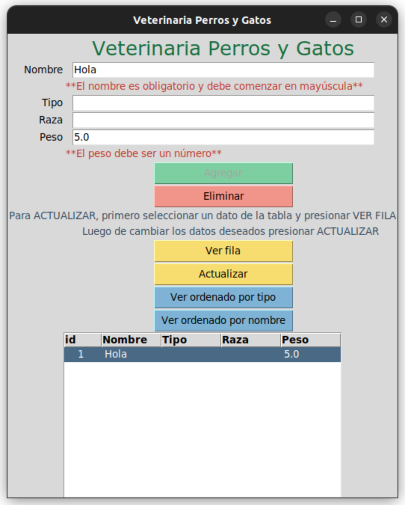

# DipoPython_TPFinal

## Table of contents
- [Overview](#overview)
  - [The challenge](#the-challenge)
  - [Screenshot](#screenshot)
- [My process](#my-process)
  - [Built with](#built-with)
  - [Useful resources](#useful-resources)
- [Author](#author)

## Overview
TP Final de la Diplomatura en Python cursada en UTN BA

### The challenge
Este trabajo fue creado a partir de tres niveles de cursada.
Nivel 1: Crear una app que contenga un ABM con toma de datos de teclado, utilizando SQLite3 y regex para validación de al menos un dato.
Nivel 2: La app debe usarse según el paradigma POO, se debe implementar MVC, agregar excepciones y documentar con Sphinx
Nivel 3: Agregar Decoradores y patrón observador. Además, implementar un servidor para generar un registro de log con la información que llega desde un cliente.
### Screenshot

Para agregar se debe elejir una fila y luego click en actualizar, por eso se desactiva el botón de Agregar

### Links
- URL: [Github](https://github.com/eseoxalde/DipoPython_TPFinal)

## My process
Por facilidad, decidí hacer un abm de pacientes de una veterinaria, con 4 datos de entrada: nombre, tipo, raza y peso. El nombre es obligatorio y se valida que comience con mayúscula, el peso no es obligatorio pero se valida que sea un número.

### Built with
Python3
Se pretende cumplir con pep8
Interfaz creada con Tkinter
Documentación con Sphinx

### Useful resources
- [Python pep8](https://peps.python.org/pep-0008/) - Página oficial de pep8
- [Python tkinter](https://guia-tkinter.readthedocs.io/es/develop/chapters/5-basic/5.1-Intro.html) - Guía de tkinter
- [Python Sphinx] (https://www.sphinx-doc.org/en/master/) - Guía de Sphinx

## Author
- Linkedin - [eseoxalde](https://www.linkedin.com/in/eseoxalde/)
- Github - [eseoxalde](https://github.com/eseoxalde)

